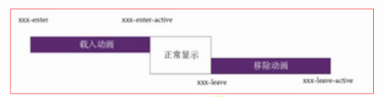

# 安装环境
> 1.查看vue安装版本 vue -V
> 1.全局安装 vue-cli npm install vue-cli -g
> 2.vue init webpack [project-name] > 选择安装rooter > 然后一路No
> 3.cd [project-name] > npm install
> 4.npm install jquery less less-loader --save-dev
# 新建目录

# render函数
> 修改入口文件 main.js
```
new Vue({
  el: '#app',
  router,
  render: x => x(App)
})
```
# vue-router路由 
设置router > index.js
```
import Vue from 'vue'
import Router from 'vue-router'
import Home from '@/view/Home'
import Product from '@/view/Product'
import Detail from '@/view/Detail'
import Pro1 from '@/view/Pro1'
import Pro2 from '@/view/Pro2'
Vue.use(Router)
//子目录视图模板
const proChilren = {
    template: `
        <router-view class="proChilren"></router-view>
    `
}
export default new Router({
  routes: [
    {path: '/',name: 'home',component: Home}, //主路由
    {path: '/product',component: proChilren,
        children: [   //子路由
            {path: '/',component: Product},
            {path: 'pro1',component: Pro1},
            {path: 'pro2',component: Pro2}
        ]
    },
    {path: '/detail',name: 'detail',component: Detail}
  ]
})
```
编写App.vue
```
<template>
  <div id="app">
    <router-view></router-view>  <!-- 用来放置要显示的路由页面 -->
    <navbar></navbar>
  </div>
</template>
<script>
import Navbar from '@/components/Navbar';//引入导航组件
export default {
  name: 'app',
  components: {'navbar':Navbar} //挂载导航组件
}
</script>
```
编写导航组件
```
<template>
  <div class="navbar">
    <ul>
      <li :class="{cur:tabIndex==0}" @click="changeTab(0)"><router-link to="/">首页</router-link></li>
      <li :class="{cur:tabIndex==1}" @click="changeTab(1)"><router-link to="/product">产品</router-link></li>
         <ul>
           <li :class="{curChild:tabIndex==1&&cIndex==0}" @click="changeTab(1,0)"><router-link to="/product/pro1">产品1</router-link></li>
           <li :class="{curChild:tabIndex==1&&cIndex==1}" @click="changeTab(1,1)"><router-link to="/product/pro2">产品2</router-link></li>
         </ul>
      <li :class="{cur:tabIndex==2}" @click="changeTab(2)"><router-link to="/detail">介绍</router-link></li>
    </ul>
  </div>
</template>
<script>
export default {
  name: 'navbar',
  data(){
    return { tabIndex: 0, cIndex: -1 };
  },
  methods: {
    changeTab(n,m){
      this.tabIndex = n;
      this.cIndex = m !== undefined ? m : -1;
    }
  }
}
</script>
```
> path设置为 '/',component设置为Home，那么在地址栏为localhost:8080/#/时，app中的router-view显示的是home页面
> 同理，path: '/product',component: Product，localhost:8080/#/product，则显示Product页面
> 子路由与主路由应该使用不同的 router-view


# 通过路由传递参数
> 1.通过name传递参数
> 路由配置 {path: '/',name:'homePage',component: Home}
> 获取参数 $route.name

> 2.通过router-link方式传递（name与params结合使用）
```
<router-link :to="{ name:'pro1Page',params: {id:123} }"
<!-- name设置为跟router定义的一致，这样就能确定将参数传递到哪个页面params是要传的参数。是一个object -->
<!-- 在页面中获取参数 $router.params.id -->
```
> 3.url传值
```
//路由
  routes: [
    {path: '/',component: Home},
    {path: '/product/:aaa/:bbb',component: Product}, //url传递变量aaa和bbb
    {path: '/detail/:id(\\d+)',component: Detail} //url传递变量id，但是利用正则表达式，(正则表达式)，注意要用转义字符 \
  ]
//参数赋值
<router-link to="/product/fuck/you">产品</router-link>
<router-link to="/detail/123">介绍</router-link>
<router-link to="/detail/abc">介绍</router-link> 获取不到值，因为正则表达式定义了参数只能是数字
//获取参数值
Product: $route.params -> {"aaa":"fuck","bbb":"you"}
Detail: $route.params -> {"id":"123"}
```
> 4.query
> 使用query就不需要name了
> 有时候数据变量是从数据库中获取的，在路由里没办法直接确定path的路径(例如users/s/xfz)，因此通过配置query与path的方式来实现
```
export default new Router({
  // mode: 'history',
  base: __dirname,
  routes: [
    {path: '/',component: Home},
    {path: '/users',component: Users,
        children: [
            {path:':username',name:'user',component:User} //注意path绑定的是变量 :username, username通过router-link来赋值
        ]
    } 
  ]
})
    <ul>
      <li :class="{cur:tabIndex==0}" @click="changeTab(0)"><router-link to="/">首页</router-link></li>
      <li :class="{cur:tabIndex==1}" @click="changeTab(1)"><router-link to="/Users">Users</router-link></li>
        <ul>
          <li :class="{curChild:tabIndex==1&&cIndex==0}" @click="changeTab(1,0)"><router-link :to="{path:'users/xfz',query:{aaa:'bbb'}}">xfz</router-link></li>
        </ul>
    </ul>
username被替换成xfz了, query后面跟的是参数，http://localhost:8080/#/users/xfz?aaa=bbb
获取usernme和query定义的变量 {{ $route.params }}  {{ $route.query }}
```
# 路由重定向 (redirect)
```
export default new Router({
  routes: [
    {path: '/',name:'homePage',component: Home},
    {path: '/product',component: proChilren,
        children: [
            {path: '/',name:'productPage',component: Product},
            {path: 'pro1/:id',name:'pro1Page',component: Pro1},
            {path: 'pro2',name:'pro2Page',component: Pro2},
            {path: 'topro1/:id',redirect:'pro1/:id'}  重定向到pro1/:id，必须要与重定向到的页面的path完全匹配，连参数都要一起匹配
        ]
    },
    {path: '/detail',name:'detailPage',component: Detail},
    {path: '/ccc/:id',redirect:xxx => {
        const {hash,params,query} = xxx;
        //通过函数的方式，根据参数判断要重定向到哪个页面
        if(params.id == '001'){  
            return '/';
        }else if(params.id == '002'){
            return '/detail'
        }
    }}
  ]
})
//link
<li><router-link to="/">首页</router-link></li>
<li to="/product/fuck/you">产品</router-link></li>
    <ul>
        <li><router-link to="/product/pro1/222">产品1</router-link></li>
        <li><router-link to="/product/pro2">产品2</router-link></li>
        <li><router-link to="topro1/333">跳到产品1</router-link></li> 重定向产品1时，路径为 /product/pro1/333，参数id值为333
    </ul>
<li><router-link to="/detail/123">介绍</router-link></li>
<li><router-link to="/ccc/001">toHome</router-link></li>
<li><router-link to="/ccc/002">toDetail</router-link></li>
```
# alias别名
> 是相对于模板的别名,通过alias可以找到相对应的路由
```
{path: '/',name:'homePage',component: Home, alias: '/gogo'}
<router-link to="/gogo">gogo</router-link>
```

# 路由表的组件群
```
//路由 index.js
export default new Router({
  routes: [
    {path: '/',components: {
        default: Home,
        left: Product,
        right: Detail
    }},
    {path: '/product',components: {
        default: Home,
        left: Product,
        right: Detail
    }},
    {path: '/detail',components: {
        default: Home,
        left: Product,
        right: Detail
    }}
  ]
})

//App.vue
<router-view class="page"></router-view>
<router-view class="page" name="left" style="float:left;width:50%;background:orange;height:300px;"></router-view>
<router-view class="page" name="right" style="float:left;width:50%;background:#ff6606;height:300px;"></router-view>
```
> 这样我们就可以一个链接控制多个router-view


# 路由的过渡动画

```
//App.vue
    <transition name="fade" mode="out-in">
      <router-view></router-view>
    </transition>
//index.html
<style>
    .fade-enter-active,.fade-leave-active{
      transition: opacity .5s;
    }
    .fade-enter,.fade-leave-active{
      opacity: 0
    }
</style>
```

# 404 找不到路由地址，一般会指向home页
```
{path: '*',component: page404} 用 * 表示找不到时，跳到page404
<router-link to="/hel">帮助</router-link> 正确的地址是 /help，而地址错误会跳到404页面
```
> 注意: 404页面 * 必须定义在routes里的最后面

# 路由钩子
> 通俗讲，通过路由地址，准备加载下一地址时，钩子函数向路由告知这一信息，路由根据汇报上来的信息决定是否允许执行
```
    {path: '/detail',component: Detail,
        //进入之前
        beforeEnter: (to,from,next) => {
            console.log(to);
            console.log(from);
            console.log(next);
            //next(false);//可以跳转连接了，如果next(false)则不可以
            next({path:'/page404'})
        },
    },
//准备跳/detail时被钩子给强行重定向到404也page404，to,from可以获取路由信息，这样我们可以通过参数来控制路由的跳转
//看看page404
  beforeRouteEnter: (to,from,next) => {
    console.log(to);
    console.log(from);
    next()
  },
  beforeRouteLeave: (to,from,next) => {
    console.log(to);
    console.log(from);
    next()
  },
同样可以获取到进入时，与离开时的路由信息
```

# 编程式导航
> 在方法里调用
```
router.go(-1)  后退
router.go(-1)
router.push('/') 返回首页
router.push({path:'/product',query:{id:'456',b:'2'}}) query的方式 
router.push({name: 'user', params: { userId: 123 }})
router.replace()同router.push,不同就是,它不会向history添加新记录，而是替换掉当前的 history,这样做可以防止后退到上一个页面，比如提交订单成功后，点击后退但不能后退至表单提交页面
// push的query方式并不能动态的修改路由表，
```

# Vuex
> vuex把公用的数据及方法存放在控制中心仓库store，相当于全部变量与全局方法
> 1.安装: npm install vuex --save-dev
> 2.在src下创建文件store.js
```
import Vue from 'vue'
import Vuex from 'vuex'
Vue.use(Vuex)
//公共数据
const state = {
    count : 4
}
//公共方法
const mutations = {
    add(state){
        state.count++;
    },
    struc(state){
        state.count--;
    }
},
//用于计算公共数据，与组件中的computed结合使用
const getters = {
    //在getter里面不要使用箭头函数
    num : function(state){
        return state.num += 10; 
    }
}
//与mutations类似的，但是异步的，支持批处理
const actions = {
    addPlus(context){//context代表了整个store
        setTimeout(() => {
            context.commit('add',{a:2})
        }, 3000)
    }
}
export default new Vuex.Store({
    state,      //加入变量  固定名称  访问状态对象
    mutations,   //加入方法  固定名称  触发状态 同步的
    getters,     //加入计算属性 固定名称  
    actions,     //加入异步动作 固定名称  
})
```
> 3.main.js
```
import store from './store'
new Vue({
  el: '#app',
  store,
  router,
  render: x => x(VueTest)
})
```
> 4.组件中获取vuex中的数据及方法
```
 <p>{{ $store.state.count }} - {{_count_}}</p>
 <p>
   <button @click="$store.commit('add')">add</button> 
   <button @click="struc">struc</button>
</p>
<p>{{ num }}</p>
import { mapState,mapMutations,mapGetters } from 'vuex'
export default {
  name : 'app',
  data(){
    return {
      count : 0 
    }
  },
  // computed : {
  //   _count(){
  //     this.count = this.$store.state.count
  //     return this.$store.state.count;
  //   }
  // }
  computed : {
    ...mapState({
     _count: state => state.count
    }),
    ...mapState([
      'count'
    ]),
    ...mapGetters([
        'num'
    ])
  },
  methods: {
    ...mapMutations(['add','struc']),
    ...mapActions(['addPlus']) //执行addPlus，3秒后+2
  }
}
```
# vuex模块化（不建议使用）
> 编辑store
```
const mym = {
    state,
    mutations,
    getters,
    actions
}
export default new Vuex.Store({
    modules : {
        mym
    }
})
//获取时
$store.state.mym.count
```
